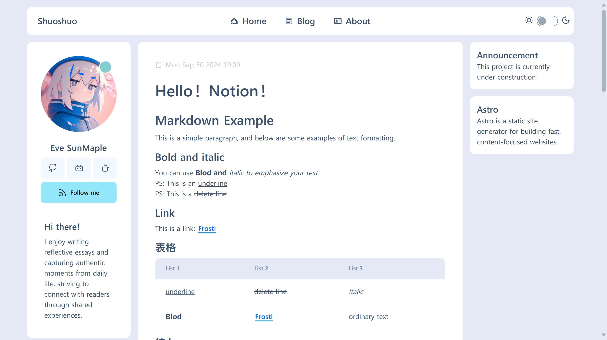

# Shuoshuo (with Notion)

<pre align="center">
This program is under development, for more information, please visit [Shuoshuo/About](https://demo.shuoshuo.saroprock.com/about)
</pre>

[](https://github.com/EveSunMaple/Shoushou/blob/main/LICENSE)&nbsp;&nbsp;&nbsp;[](https://github.com/EveSunMaple/Shoushou/releases)&nbsp;&nbsp;&nbsp;[](https://stackblitz.com/github/EveSunMaple/Shoushou)

```sh
pnpm create astro@latest -- --template EveSunMaple/Shoushou
```

Please visit [Demo](https://demo.shuoshuo.saroprock.com)

## 🚀 About

> "This project leverages Astro + Notion to create a dynamic website that fetches data directly from Notion. A standout feature is the Shuoshuo page, where you can share quick, spontaneous moments in a format similar to Twitter posts. Alongside the Shuoshuo, the site also features standard blog pages, making it a perfect blend of casual updates and full-length articles, catering to both concise thoughts and in-depth content."

## 🖥️ Preview



## 🧞 Commands

All commands are run from the root of the project, from a terminal:

| Command                   | Action                                           |
| :------------------------ | :----------------------------------------------- |
| `npm install`             | Installs dependencies                            |
| `npm run dev`             | Starts local dev server at `localhost:4321`      |
| `npm run build`           | Build your production site to `./dist/`          |
| `npm run preview`         | Preview your build locally, before deploying     |
| `npm run astro ...`       | Run CLI commands like `astro add`, `astro check` |
| `npm run astro -- --help` | Get help using the Astro CLI                     |